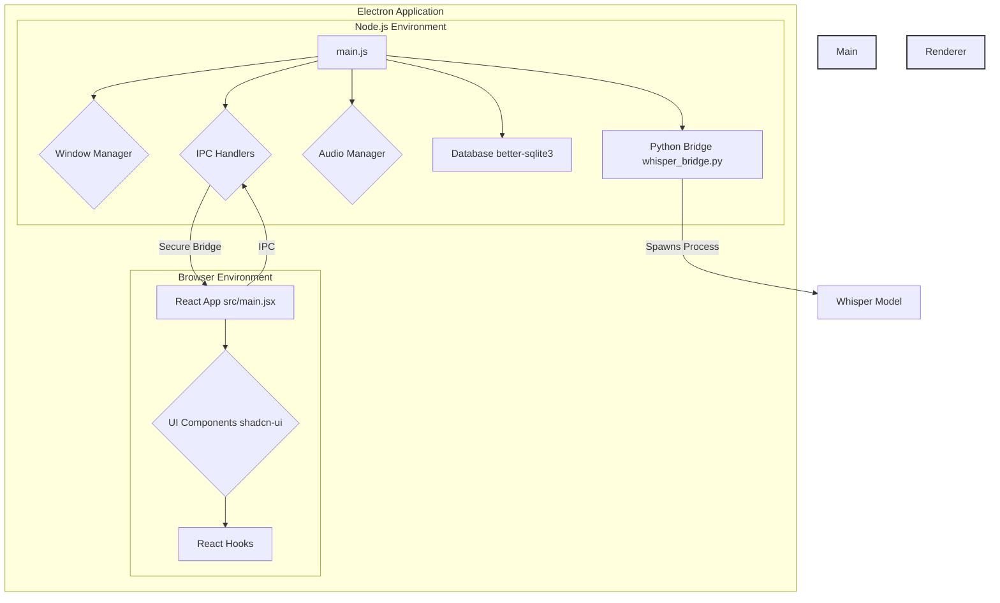

# Project Overview: OpenWhispr

**OpenWhispr** is a desktop dictation application that uses online tts apis to dictate speech to text. It is built as a cross-platform application using **Electron**.

## Technologies and Dependencies

- **Core Framework**: The application is built with **Electron**, allowing it to run on macOS, Windows, and Linux using a single codebase.
- **Frontend**: The user interface is a **React** application, built with **Vite** for fast development and bundling. It is styled using **Tailwind CSS**, and the UI components are from the **shadcn-ui** library, which is built on top of **Radix UI** for accessibility.
- **Backend (Main Process)**: The main process logic is written in JavaScript and runs in a Node.js environment. It manages application windows, native OS integrations, and core functionalities.
- **Speech-to-Text**: The core transcription functionality is powered by the **Whisper** model. A Python script ([`whisper_bridge.py`](../workflows/whisper_bridge.py)) is used to interface with the model. Audio processing is likely handled by **`ffmpeg-static`**.
- **Data Storage**: The application uses a local **SQLite** database ([`better-sqlite3`](../workflows/package.json:76)) for data persistence.
- **Development Tools**: The project uses **ESLint** for code quality, **`concurrently`** to run multiple development processes, and **`electron-builder`** to package the application for distribution.

## Project Structure

The project is organized into a main process and a renderer process, which is standard for Electron applications.

- **Root Directory**: Contains configuration files like [`package.json`](../workflows/package.json), the Electron main process entry point ([`main.js`](../workflows/main.js)), and a preload script ([`preload.js`](../workflows/preload.js)) for secure communication between the two processes.
- **`src/` directory**: This directory holds all the frontend code for the renderer process. It includes the React application's entry point ([`main.jsx`](../workflows/src/main.jsx)), components, hooks, and other UI-related logic.
- **`helpers/` directory**: This is a crucial part of the main process logic, containing modules for managing audio ([`audioManager.js`](../workflows/src/helpers/audioManager.js)), the database ([`database.js`](../workflows/src/helpers/database.js)), and inter-process communication ([`ipcHandlers.js`](../workflows/src/helpers/ipcHandlers.js)).
- **`scripts/` and `resources/`**: These directories contain build scripts and platform-specific resources for creating the final application packages.

## Architecture Diagram

The following diagram illustrates the high-level architecture of the OpenWhispr application:

## Project Structure

open-whispr/
├── main.js # Electron main process & IPC handlers
├── preload.js # Electron preload script & API bridge
├── whisper_bridge.py # Python script for local Whisper processing
├── setup.js # First-time setup script
├── package.json # Dependencies and scripts
├── env.example # Environment variables template
├── CHANGELOG.md # Project changelog
├── src/
│ ├── App.jsx # Main dictation interface
│ ├── main.jsx # React entry point
│ ├── index.html # Vite HTML template
│ ├── index.css # Tailwind CSS v4 configuration
│ ├── vite.config.js # Vite configuration
│ ├── components/
│ │ ├── ControlPanel.tsx # Settings and history UI
│ │ ├── OnboardingFlow.tsx # First-time setup wizard
│ │ ├── SettingsPage.tsx # Settings interface
│ │ ├── ui/ # shadcn/ui components
│ │ │ ├── button.tsx
│ │ │ ├── card.tsx
│ │ │ ├── input.tsx
│ │ │ ├── LoadingDots.tsx
│ │ │ ├── DotFlashing.tsx
│ │ │ ├── Toast.tsx
│ │ │ ├── toggle.tsx
│ │ │ └── tooltip.tsx
│ │ └── lib/
│ │ └── utils.ts # Utility functions
│ ├── services/
│ │ └── ReasoningService.ts # Multi-provider AI processing (OpenAI/Anthropic/Gemini)
│ ├── utils/
│ │ └── agentName.ts # Agent name management utility
│ └── components.json # shadcn/ui configuration
└── assets/ # App icons and resources
